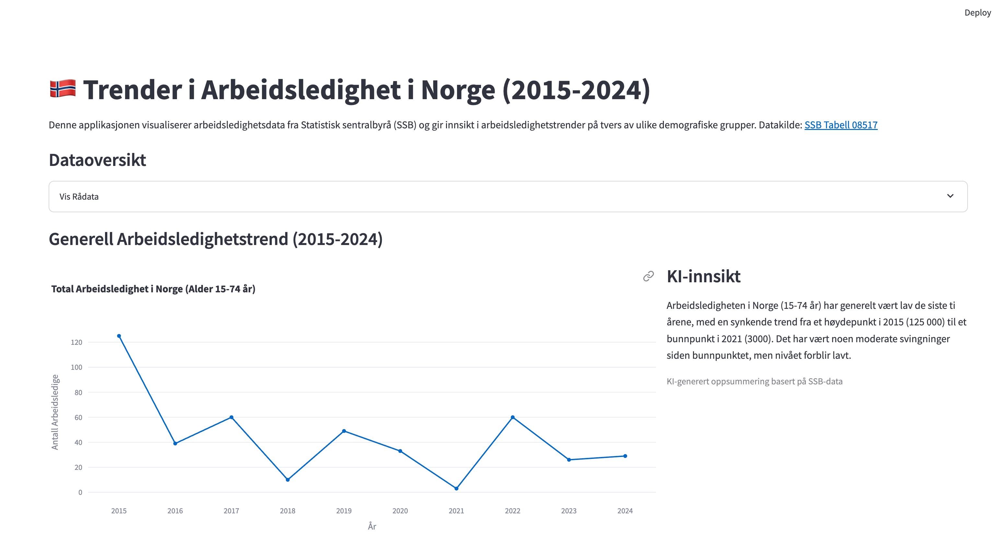

# Sladrehank - Innsikt i Norsk Arbeidsledighet

## Beskrivelse
Denne applikasjonen visualiserer arbeidsledighetsdata fra Statistisk sentralbyrå (SSB) for perioden 2015-2024. Formålet er å gi brukere en interaktiv og lettforståelig oversikt over arbeidsledighetstrender i Norge, med detaljert innsikt fordelt på kjønn og aldersgrupper.

Applikasjonen bruker Google Gemini AI til å generere kontekstuell innsikt og analyser av dataene, som gir brukerne en dypere forståelse av trendene.

## Direkte tilgang
Du kan få tilgang til den deployerte versjonen av appen her: [Sladrehank - Arbeidsledighetsapp](https://sladerhankc.streamlit.app/)

## Skjermbilde


## Funksjoner
- **Generell arbeidsledighetstrend**: Visualisering av den totale arbeidsledigheten i Norge fra 2015 til 2024
- **Kjønnsbasert sammenligning**: Analyse av arbeidsledighetstrender fordelt på kjønn
- **Aldersgruppeanalyse**: Detaljert visning av arbeidsledighet på tvers av ulike aldersgrupper
- **KI-generert innsikt**: Automatisk genererte analyser av dataene ved hjelp av Google Gemini
- **Interaktive grafer**: Brukervennlige visualiseringer med Plotly
- **Responsivt grensesnitt**: Fungerer på både desktop og mobile enheter

## Avhengigheter
Applikasjonen er bygget med følgende Python-biblioteker:
- streamlit>=1.20.0
- pandas>=1.3.0
- requests>=2.25.0
- plotly>=5.5.0
- google-generativeai>=0.3.0
- python-dotenv>=0.19.0

## Installasjon

### 1. Klon prosjektet
```bash
git clone https://github.com/Tijanif/sladerhankc.git
cd sladerhankc
```

### 2. Opprett et virtuelt miljø (anbefalt)
```bash
python3 -m venv venv
source venv/bin/activate  # På Windows: venv\Scripts\activate
```

### 3. Installer avhengigheter
```bash
pip install -r requirements.txt
```

### 4. Sett opp Google Gemini API-nøkkel
For å bruke KI-funksjonene i appen, trenger du en Google Gemini API-nøkkel. 

1. Gå til [Google AI Studio](https://ai.google.dev/) og opprett en konto hvis du ikke har en
2. Generer en API-nøkkel
3. Opprett en `.env`-fil i prosjektmappen med følgende innhold:
```
GEMINI_API_KEY=din_api_nøkkel_her
```

**Merk**: `.env`-filen er lagt til i `.gitignore` og vil ikke bli inkludert i Git-repository for å beskytte API-nøkkelen din.

## Kjøre applikasjonen

### Online versjon
Den enkleste måten å bruke applikasjonen på er å besøke den deployerte versjonen på Streamlit Cloud:
[https://sladerhankc.streamlit.app/](https://sladerhankc.streamlit.app/)

### Lokal kjøring
Hvis du ønsker å kjøre applikasjonen lokalt, følg disse trinnene:

Start Streamlit-appen med følgende kommando:
```bash
streamlit run app.py
```

Hvis du støter på problemer med streamlit-kommandoen, kan du også kjøre:
```bash
python -m streamlit run app.py
```

Applikasjonen vil være tilgjengelig i nettleseren din på `http://localhost:8501`.

## Datakilder
Alle data er hentet fra SSB (Statistisk sentralbyrå) via deres API, spesifikt fra tabell 08517. Dataene viser arbeidsledighet i Norge fordelt på kjønn og aldersgrupper for perioden 2015-2024.

Datakildelink: [SSB Tabell 08517](https://www.ssb.no/statbank/table/08517/)

## Feilsøking

### API-nøkkel ikke funnet
Hvis du får feilmeldingen "Ingen API-nøkkel funnet":
1. Kontroller at `.env`-filen er opprettet i riktig mappe
2. Kontroller at formatet på API-nøkkelen i `.env`-filen er korrekt (ingen mellomrom eller ekstra tegn)
3. Restart applikasjonen

### Problemer med datainnhenting
Hvis data ikke lastes:
1. Kontroller internettforbindelsen din
2. Sjekk om SSB-API-et er tilgjengelig
3. Se om datastrukturen i API-et har endret seg (sjekk feilmeldinger i terminalen)

## For utviklere
Prosjektet er strukturert på følgende måte:
- `app.py`: Hovedfilen med Streamlit-grensesnitt og databehandlingslogikk
- `.env`: Miljøvariabler for API-nøkler (ikke inkludert i repo)
- `.gitignore`: Definerer filer som ikke skal inkluderes i Git-repo
- `requirements.txt`: Avhengigheter for applikasjonen

For å bidra til prosjektet, vennligst følg disse retningslinjene:
1. Fork prosjektet
2. Opprett en grein for din funksjonalitet (`git checkout -b funksjon/din-funksjonalitet`)
3. Commit endringene dine (`git commit -m 'Legg til ny funksjonalitet'`)
4. Push til greinen (`git push origin funksjon/din-funksjonalitet`)
5. Åpne en Pull Request

## Lisens
Dette prosjektet er lisensiert under MIT-lisensen - se LICENSE-filen for detaljer.

## Kontakt
For spørsmål eller tilbakemeldinger, vennligst kontakt utvikleren [Tijani Fulani](https://github.com/Tijanif).

---

© 2025 Sladrehank - Innsikt i Norsk Arbeidsledighet 